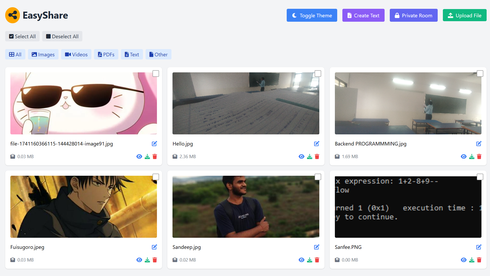

# EasyShare - Simple File Sharing Application

EasyShare is a web-based file sharing application that allows users to easily upload, share, and manage files with customizable access controls.



Project link : https://shareitnow-6zno.onrender.com/

## Features

- 🌓 Dark/Light theme support
- 📤 Drag & drop file uploads
- 📊 Real-time upload progress
- 🔍 File filtering by type
- ✏️ Inline file renaming
- 🔐 Private rooms with password protection
- 🔗 Temporary share links (24-hour expiry)
- 📝 Text file creation and editing
- 📱 Responsive design for all devices

## Tech Stack

- **Frontend**: HTML, CSS (Tailwind CSS), JavaScript
- **Backend**: Node.js, Express.js
- **Storage**: Cloudinary
- **Icons**: Font Awesome
- **HTTP Client**: Axios

## Installation

1. Clone the repository:
```bash
git clone https://github.com/yourusername/EasyShare.git
cd EasyShare
```

2. Install dependencies:
```bash
npm install
```

3. Create a `.env` file in the root directory with your Cloudinary credentials:
```env
CLOUD_NAME=your_cloud_name
CLOUD_API_KEY=your_api_key
CLOUD_API_SECRET=your_api_secret
PORT=8080
```

4. Start the server:
```bash
npm start
```

## Usage

1. **File Upload**: 
   - Click the "Upload File" button or drag & drop files
   - Monitor upload progress in real-time
   - View uploaded files in the grid layout

2. **File Management**:
   - Filter files by type using the filter buttons
   - Rename files by clicking the edit icon
   - Preview, download, or delete files using the action buttons

3. **Sharing Files**:
   - Select multiple files using checkboxes
   - Click "Share Selected" to generate a temporary share link
   - Share links expire after 24 hours

4. **Private Rooms**:
   - Create a private room with custom ID and password
   - Share the room link with intended recipients
   - Access rooms using credentials

5. **Text Files**:
   - Create and edit text files directly in the browser
   - Save and share text content seamlessly

## Project Structure

```
FileShare/
├── views/
│   ├── index.ejs
│   ├── shared.ejs
│   └── error.ejs
├── public/
│   └── css/
├── index.js
├── package.json
└── .env
```

## Contributing

1. Fork the repository
2. Create your feature branch (`git checkout -b feature/AmazingFeature`)
3. Commit your changes (`git commit -m 'Add some AmazingFeature'`)
4. Push to the branch (`git push origin feature/AmazingFeature`)
5. Open a Pull Request

## License

This project is licensed under the MIT License - see the [LICENSE](LICENSE) file for details.

## Acknowledgments

- [Tailwind CSS](https://tailwindcss.com/) for the styling
- [Font Awesome](https://fontawesome.com/) for the icons
- [Cloudinary](https://cloudinary.com/) for file storage
- [Express.js](https://expressjs.com/) for the backend framework

## Support

For support, email support@easyshare.com or open an issue in the repository.